# CSE Research Hub — Master Design Reference & System Architecture

> **Document Version:** 1.0.0  
> **Status:** Canonical Master Reference  
> **Design Source of Truth:** Stitch Export (`design_reference/stitch/`)  
> **Target Platforms:** Android (Physical Device), iOS / macOS, Windows  

---

## 1. Product Purpose & Philosophy

**CSE Research Hub** is a native mobile application designed specifically for the Computer Science & Engineering (CSE) university department community (students, researchers, alumni, and faculty).

### The Core Journey
$$\text{DISCOVER} \longrightarrow \text{UNDERSTAND} \longrightarrow \text{CONNECT}$$

### People-First Research Discovery & Networking
* **People > Papers:** Academic tools often treat research purely as static citation indexes. CSE Research Hub prioritizes *the researcher*—who they are, what they are curious about right now, what projects they are actively developing, and how to collaborate with them.
* **Active Momentum > Archive Only:** Bridges the gap between in-progress ideas ("Current Work") and finalized publications ("Previous Research").

### Strict Product Boundaries (What CSE Research Hub is NOT)
* ❌ NOT a paper-writing or LaTeX drafting tool.
* ❌ NOT a PDF repository or direct file hosting platform.
* ❌ NOT a generic social media clone (no algorithmic engagement bait, likes, vanity follower counts).
* ❌ NOT a replacement for Google Scholar / ResearchGate / IEEE Xplore (it links to them externally).
* ❌ NOT a project management / Jira-style issue tracker.

---

## 2. Core Design Principles

1. **Academic & Professional:** Clean, authoritative, and focused. Evokes the clarity of top-tier academic institutions and modern scholarly publishing.
2. **High Signal, Zero Clutter:** Content-first information density without visual noise. Generous whitespace, disciplined typography, and structured metadata.
3. **Tactile Depth over Flatness:** Uses low-contrast borders (`#E4E8F0`), subtle tonal layers, and minimal diffused ambient elevation instead of heavy drop shadows or flashy glassmorphism.
4. **Accessible & Responsive:** High-contrast text hierarchy (`#172033` on `#FFFFFF`/`#F6F8FC`), 48dp+ interactive touch targets, and resilient responsive layouts across Android and iOS viewports.
5. **Canonical Simplicity:** "One Feature $\rightarrow$ One Canonical Screen $\rightarrow$ Reusable Components".

---

## 3. Design Tokens & System Specifications

### 3.1 Color Palette

```typescript
export const Colors = {
  // Brand & Accent
  primary: '#3157C8',          // Academic Royal Blue (Primary actions, brand accents, active tabs)
  primaryDark: '#0A3DAF',      // Deep Academic Blue (Pressed states, high-contrast headers)
  primaryLight: '#DCE1FF',     // Tinted primary container
  primaryMuted: '#EEF2FF',     // Primary badge background / active item background

  secondary: '#159A9C',        // Research Teal (Topic chips, momentum tags, secondary badges)
  secondaryLight: '#E0F7F6',   // Soft Teal container
  secondaryDark: '#00696B',    // Dark teal for chip labels

  accent: '#B45309',           // Knowledge Amber / Warning (Highlights, awards, pending status)
  accentLight: '#FEF3C7',      // Light amber container

  // Neutrals & Backgrounds
  background: '#F6F8FC',       // Canvas background (soft scholarly cool gray)
  surface: '#FFFFFF',          // Card & container surface
  surfaceElevated: '#FFFFFF',  // Modals & sheets
  surfaceSubtle: '#F1F4F9',    // Input fields, inactive tabs, pill backgrounds

  // Typography Neutrals
  textPrimary: '#172033',      // Deep navy/slate for titles & primary reading text
  textSecondary: '#667085',    // Slate gray for metadata, sub-labels, timestamps
  textMuted: '#94A3B8',        // Inactive icons, placeholder text
  textInverse: '#FFFFFF',      // Text on primary buttons

  // Structural & Borders
  border: '#E4E8F0',           // Standard 1px card/divider outline
  borderFocus: '#3157C8',      // Active input/filter border
  borderSubtle: '#EDF1F7',     // Secondary dividers

  // Functional / Feedback
  success: '#16A34A',          // Success states & verified badges
  successLight: '#DCFCE7',
  error: '#DC2626',            // Error alerts & destructive actions
  errorLight: '#FEE2E2',
  warning: '#D97706',
  warningLight: '#FEF3C7',
  info: '#0284C7',
  infoLight: '#E0F2FE',
} as const;
```

### 3.2 Typography

We employ a dual-font strategy:
* **Serif (`Source Serif 4` / System Serif Fallback):** Reserved for major editorial titles, paper headings, and top-level identity headers to impart scholarly authority.
* **Sans-Serif (`Inter` / System Sans-Serif Fallback):** Used for all UI controls, body text, metadata, form labels, buttons, and navigation.

| Token | Family | Size | Weight | Line Height | Letter Spacing | Usage |
| :--- | :--- | :--- | :--- | :--- | :--- | :--- |
| `display` | Serif | 30px | Bold (700) | 38px | -0.02em | Splash, Welcome Header |
| `headline` | Serif | 22px | SemiBold (600) | 28px | -0.01em | Screen Titles, Paper Titles in Detail View |
| `title` | Sans | 17px | SemiBold (600) | 24px | 0 | Card Headings, Section Headers |
| `body` | Sans | 15px | Regular (400) | 22px | 0 | Descriptions, Bio, Post Overviews |
| `bodyMedium` | Sans | 15px | Medium (500) | 22px | 0 | Form Inputs, Key Value Pairs |
| `subhead` | Sans | 13px | Regular (400) | 18px | 0 | Metadata (Batch, Department, Dates) |
| `caption` | Sans | 12px | Medium (500) | 16px | +0.02em | Tag/Chip Labels, Timestamps |
| `button` | Sans | 15px | SemiBold (600) | 20px | +0.01em | Primary & Secondary Button Labels |

### 3.3 Spacing Grid (8pt Baseline)

* `xs`: 4px
* `sm`: 8px
* `md`: 16px (Standard page padding & card interior spacing)
* `lg`: 24px (Section separation)
* `xl`: 32px (Major layout blocks)
* `xxl`: 48px

### 3.4 Corner Radius

* `xs`: 4px (Badges, small indicators)
* `sm`: 8px (Buttons, text inputs, small cards)
* `md`: 12px (Standard research cards, modal surfaces)
* `lg`: 16px (Prominent highlight containers)
* `full`: 9999px (Pills, topic chips, circular avatars)

### 3.5 Elevation & Borders
* Cards utilize `borderWidth: 1`, `borderColor: '#E4E8F0'` and minimal ambient shadow:
  ```typescript
  shadowColor: '#172033',
  shadowOffset: { width: 0, height: 2 },
  shadowOpacity: 0.04,
  shadowRadius: 6,
  elevation: 2, // Android
  ```

---

## 4. Master Screen Inventory & Canonical Mapping

Below is the exhaustive mapping of all **34 Stitch Export Folders** to their canonical feature implementation.

| Stitch Folder | Canonical Status | Canonical Feature | Proposed React Native Route (`src/app/`) |
| :--- | :--- | :--- | :--- |
| `splash_brand_entry_canonical` | **Canonical** | App Splash & Init Screen | `(auth)/splash.tsx` or `index.tsx` |
| `authentication_login_canonical` | **Canonical** | User Login | `(auth)/login.tsx` |
| `authentication_sign_up_canonical` | **Canonical** | Create Account / Register | `(auth)/sign-up.tsx` |
| `authentication_verify_email_canonical` | **Canonical** | Institutional Email Verification | `(auth)/verify-email.tsx` |
| `forgot_password_request_canonical` | **Canonical** | Password Reset Request | `(auth)/forgot-password.tsx` |
| `forgot_password_success_canonical` | **Canonical** | Password Reset Link Confirmation | `(auth)/forgot-password-success.tsx` |
| `onboarding_welcome_academic_excellence` | **Canonical** | Onboarding Step 1: Welcome | `(onboarding)/welcome.tsx` |
| `onboarding_research_interests_academic_excellence` | **Canonical** | Onboarding Step 2: Topic Selection | `(onboarding)/interests.tsx` |
| `onboarding_current_work_academic_excellence` | **Canonical** | Onboarding Step 3: Current Work | `(onboarding)/current-work.tsx` |
| `onboarding_external_profiles_academic_excellence` | **Canonical** | Onboarding Step 4: External Profiles | `(onboarding)/external-profiles.tsx` |
| `onboarding_ready_to_explore_academic_excellence` | **Canonical** | Onboarding Step 5: Ready to Explore | `(onboarding)/ready.tsx` |
| `home_feed_canonical_final` | **Canonical** | Main Home Activity Feed | `(tabs)/index.tsx` (Home) |
| `home_feed_canonical` | *Duplicate/Older* | Replaced by `home_feed_canonical_final` | — |
| `home_feed_audited` | *Duplicate/Older* | Replaced by `home_feed_canonical_final` | — |
| `explore_hub_canonical_1` | **Canonical** | Explore & Discovery Hub | `(tabs)/explore.tsx` |
| `explore_hub_canonical_2` | *Duplicate/Older* | Replaced by `explore_hub_canonical_1` | — |
| `global_search_computer_vision_canonical` | **Canonical** | Unified Search & Category Filtering | `(explore)/search.tsx` |
| `who_s_working_on_this_machine_learning_canonical` | **Canonical** | Topic-Specific Researcher Discovery | `(explore)/topic-researchers.tsx` |
| `share_current_work_canonical_final` | **Canonical** | Share / Update Current Work Modal | `(tabs)/share.tsx` or `(modals)/share-work.tsx` |
| `notifications_center_canonical_final` | **Canonical** | Notifications Center (All/Connections/Mentions) | `(tabs)/notifications.tsx` |
| `notifications_canonical` | *Duplicate/Older* | Replaced by `notifications_center_canonical_final` | — |
| `connections_canonical_final` | **Canonical** | Connections & Requests Manager | `(network)/connections.tsx` |
| `my_network_canonical` | *Duplicate/Older* | Merged into `connections_canonical_final` | — |
| `researcher_profile_canonical` | **Canonical** | Researcher Profile (Self & Other) | `(tabs)/profile.tsx` & `(profile)/[id].tsx` |
| `edit_profile_canonical` | **Canonical** | Edit Profile & Research Identity | `(profile)/edit.tsx` |
| `research_detail_canonical` | **Canonical** | Publication / Research Paper Detail | `(research)/[id].tsx` |
| `saved_items_canonical` | **Canonical** | Bookmarks & Saved Research | `(profile)/saved.tsx` |
| `settings_canonical` | **Canonical** | Settings, Account & Privacy | `(profile)/settings.tsx` |
| `loading_states_canonical` | **Canonical Spec** | Skeleton Loaders (Feed, Explore, Profile) | `src/components/common/SkeletonLoader.tsx` |
| `empty_states_canonical` | **Canonical Spec** | Universal Empty State Component | `src/components/common/EmptyState.tsx` |
| `global_error_state_canonical` | **Canonical Spec** | Error Boundary & Network Error Card | `src/components/common/ErrorState.tsx` |
| `academic_excellence_1` | *Design Spec* | Reference token catalog | Consolidated in `DESIGN.md` |
| `academic_excellence_2` | *Design Spec* | Reference token catalog | Consolidated in `DESIGN.md` |
| `scholarly_core` | *Design Spec* | Reference typography catalog | Consolidated in `DESIGN.md` |

---

## 5. Navigation Architecture

The app uses **Expo Router (File-based navigation)** with a clean hierarchical structure.

```mermaid
graph TD
    Root[Root Navigation] --> AuthGroup["(auth) Stack"]
    Root --> OnboardingGroup["(onboarding) Stack"]
    Root --> MainTabs["(tabs) Bottom Navigation"]
    Root --> DetailModals["Modal & Detail Stacks"]

    subgraph Auth Flow
        AuthGroup --> Splash[Splash / Brand]
        AuthGroup --> Login[Login]
        AuthGroup --> SignUp[Sign Up]
        AuthGroup --> VerifyEmail[Verify Email]
        AuthGroup --> ForgotPwd[Forgot Password]
        AuthGroup --> ForgotSuccess[Reset Link Sent]
    end

    subgraph Onboarding Flow
        OnboardingGroup --> Step1[1. Welcome]
        OnboardingGroup --> Step2[2. Interests & Topics]
        OnboardingGroup --> Step3[3. Current Work]
        OnboardingGroup --> Step4[4. External Profiles]
        OnboardingGroup --> Step5[5. Ready To Explore]
    end

    subgraph Main Bottom Tabs
        MainTabs --> TabHome["1. Home (Feed)"]
        MainTabs --> TabExplore["2. Explore"]
        MainTabs --> TabShare["3. Share (+)"]
        MainTabs --> TabNotif["4. Notifications"]
        MainTabs --> TabProfile["5. Profile"]
    end

    subgraph Secondary & Detail Stacks
        TabExplore --> SearchScreen[Unified Search]
        TabExplore --> TopicScreen["Who's Working On This?"]
        TabHome --> ResearchDetail[Research Detail View]
        TabProfile --> EditProfile[Edit Profile]
        TabProfile --> SavedItems[Saved Items]
        TabProfile --> SettingsScreen[Settings]
        TabNotif --> ConnectionsManager[Connections & Requests]
        MainTabs --> ResearcherProfileView["Researcher Profile (Other)"]
    end
```



### Bottom Tab Configuration (Strict 5 Tabs)
1. **Home:** Icon: `Home` (`lucide-react-native`). Title: "Home".
2. **Explore:** Icon: `Compass` or `Search`. Title: "Explore".
3. **Share:** Icon: `PlusCircle`. Title: "Share" (Triggers creation modal).
4. **Notifications:** Icon: `Bell`. Title: "Notifications" (With badge count).
5. **Profile:** Icon: `User`. Title: "Profile".

---

## 6. Detailed Feature Specifications

### 6.1 Authentication & Onboarding Flow
* **Institutional Verification:** Registration emphasizes CSE institutional affiliation (department, student ID/batch, university email).
* **Progressive Onboarding:** 5-step wizard allowing users to immediately seed their profile with research interests, optional current work in progress, and external profile URLs (Google Scholar, GitHub, ResearchGate, Personal Website).

### 6.2 Home Screen
* **Purpose:** "What is happening in my CSE research community right now?"
* **Sections:**
  1. **Greeting & Quick Search Bar:** "Good morning, [Name]" + search trigger.
  2. **Topic Shortcuts:** Horizontal pill list (e.g., *Machine Learning*, *Computer Vision*, *NLP*, *Cybersecurity*, *HCI*).
  3. **Active Research Momentum / "People are working on":** Feed cards displaying active current work with stage tags (*Concept*, *Data Collection*, *Drafting*, *Pre-print*).
  4. **Featured / Suggested Researchers:** Compact researcher cards highlighting shared interests.
  5. **Recent Publications:** Feed items showing peer-reviewed or conference papers with direct external links.

### 6.3 Explore & "Who's Working On This?"
* **Unified Discovery Hub:**
  * Search bar with category filters (`All`, `People`, `Current Work`, `Research`).
  * **"Who's Working On This?"** feature: Clicking a topic chip (e.g., *Machine Learning*) immediately aggregates all departmental researchers actively working on or interested in that specific topic.

### 6.4 Current Work vs. Previous Research
* **Current Work (In-Progress):**
  * Represents temporary, active momentum (e.g., "Thesis on Transformer compression for Bangla NLP").
  * Fields: Title, description, topic tags, current stage (`Ideation`, `Experimentation`, `Paper in Prep`), and optional repo/demo URL.
* **Previous Research (Completed):**
  * Represents peer-reviewed papers, published journal articles, conference proceedings, or finished theses.
  * Fields: Title, authors list, conference/journal venue, publication year, overview/abstract snippet, and verified external link (Google Scholar, IEEE, ACM, ResearchGate).

### 6.5 Researcher Profile & Networking
* **Profile Header:** Clean squircle/circular avatar, full name, batch/designation, department, academic bio, and direct external profile buttons (Google Scholar, GitHub, ResearchGate, Website).
* **Research Tabs:** Segmented switcher between `Current Work` and `Publications`.
* **Connections System:** Non-social networking mechanism. Supports `Connect`, `Pending`, `Accept`, and `Decline` actions focused on academic collaboration.

### 6.6 Notifications & Activity
* Segmented into tabs: `All`, `Connections` (pending requests and accepted connections), and `Mentions/Activity`.
* Inline action buttons for rapid request acceptance/declining.

---

## 7. Reusable Component Inventory

To prevent duplication and guarantee visual consistency, the application will use the following foundational components:

| Component Name | Responsibility | Key Props / Variants |
| :--- | :--- | :--- |
| `Avatar` | User profile picture with fallback initials | `size` (sm: 32, md: 48, lg: 72, xl: 96), `uri`, `name`, `badge` |
| `Button` | Standardized primary, secondary, and text action buttons | `variant` ('primary' \| 'secondary' \| 'outline' \| 'ghost'), `size`, `label`, `icon`, `loading`, `disabled` |
| `SearchBar` | Academic search input with clear button and filter trigger | `value`, `onChangeText`, `onSubmit`, `onFilterPress`, `placeholder` |
| `TopicChip` | Topic / tag pill badge | `label`, `selected`, `onPress`, `variant` ('default' \| 'teal' \| 'outline') |
| `SectionHeader` | Standardized section title with optional "See All" action | `title`, `subtitle`, `actionLabel`, `onActionPress` |
| `ResearcherCard` | Compact and full researcher profile summary cards | `researcher`, `variant` ('compact-horizontal' \| 'full-card'), `onPress`, `onConnectPress` |
| `CurrentWorkCard` | Card representing in-progress research with status badge | `work`, `onPress`, `onBookmarkPress` |
| `ResearchCard` | Card for completed/published research papers | `research`, `onPress`, `onExternalLinkPress`, `onBookmarkPress` |
| `StatusBadge` | Stage badge (e.g. *In Progress*, *Pre-print*, *Published*) | `status`, `color` |
| `ExternalLinkButton`| Formatted link button for Google Scholar, GitHub, etc. | `type` ('scholar' \| 'github' \| 'researchgate' \| 'website'), `url` |
| `SkeletonLoader` | Shimmer/tonal skeleton placeholder for cards and feeds | `type` ('card' \| 'profile' \| 'list' \| 'chip-row'), `lines` |
| `EmptyState` | Standardized zero-data visual with icon, title, message & action | `icon`, `title`, `description`, `actionLabel`, `onActionPress` |
| `ErrorState` | Network error / crash fallback card with retry action | `title`, `message`, `onRetry` |
| `TabBar` | Custom bottom navigation bar adhering to design tokens | `state`, `descriptors`, `navigation` |

---

## 8. State Variations & Edge Cases

### 8.1 Loading States (`loading_states_canonical`)
* Use light tonal placeholder skeletons (`#EEEDF7` / `#E2E1EB`) with rounded corners instead of jarring generic spinners.
* Separate skeletons for:
  1. Home feed (greeting + chip carousel + 2 work cards).
  2. Explore list (search bar skeleton + topic grid + researcher cards).
  3. Profile view (avatar squircle + metadata block + tab bar + content cards).

### 8.2 Empty States (`empty_states_canonical`)
* Every list and tab must handle empty scenarios gracefully:
  * *No current work:* "No active projects shared yet. Share what you're researching!"
  * *No publications:* "No previous research added yet."
  * *No connections:* "You haven't connected with any researchers yet. Explore the CSE directory."
  * *No notifications:* "All caught up! Check back later for collaboration updates."
  * *No search results:* "No matching researchers or topics found for '[query]'."

### 8.3 Error States (`global_error_state_canonical`)
* Clear icon (`AlertCircle`), concise non-technical explanation, and a high-contrast `Try Again` action button.
* Offline banner at top of viewport when device loses network connectivity.

---

## 9. Recommended Technical Architecture

```text
cse-research-hub/
├── src/
│   ├── app/                      # Expo Router navigation routes
│   │   ├── (auth)/               # Splash, Login, Sign-up, Verify, Forgot Pwd
│   │   ├── (onboarding)/         # 5-step onboarding flow
│   │   ├── (tabs)/               # Bottom tabs: index, explore, share, notifications, profile
│   │   ├── (explore)/            # Search & Topic-specific discovery screens
│   │   ├── (profile)/            # Edit profile, Saved items, Settings, [id]
│   │   ├── (research)/           # [id] Research detail view
│   │   └── _layout.tsx           # Root layout & providers
│   │
│   ├── components/               # Atomic & reusable UI components
│   │   ├── common/               # Avatar, Button, TopicChip, SearchBar, Badges
│   │   ├── cards/                # ResearcherCard, CurrentWorkCard, ResearchCard
│   │   ├── feedback/             # SkeletonLoader, EmptyState, ErrorState
│   │   └── layout/               # Header, SectionHeader, ScreenContainer
│   │
│   ├── constants/                # Design tokens (Colors, Typography, Spacing)
│   │   ├── colors.ts
│   │   ├── typography.ts
│   │   └── spacing.ts
│   │
│   ├── types/                    # TypeScript data models & navigation types
│   │   ├── user.ts
│   │   ├── research.ts
│   │   ├── currentWork.ts
│   │   ├── connection.ts
│   │   └── notification.ts
│   │
│   ├── data/                     # Mock data sets for Phase 2 UI development
│   │   ├── mockUsers.ts
│   │   ├── mockResearch.ts
│   │   └── mockCurrentWork.ts
│   │
│   ├── hooks/                    # Custom React hooks (useTheme, useAuth, useDebounce)
│   ├── context/                  # React contexts (AuthContext, SavedContext)
│   └── utils/                    # Helper utilities (formatters, link opener, validation)
│
├── design_reference/             # Design specs & Stitch export assets
│   ├── DESIGN.md                 # Single Master Design Reference (This file)
│   └── stitch/                   # 34 Stitch screen exports
│
├── assets/                       # Static fonts, icons, branding images
├── app.json                      # Expo application manifest
├── package.json
└── tsconfig.json
```

---

## 10. Implementation Rules & Best Practices

1. **Strict Styling Discipline:** Use **React Native `StyleSheet.create`** with centralized tokens imported from `src/constants/`. This eliminates third-party build friction, guarantees maximum runtime performance, and works consistently across Android, iOS, macOS, and Windows.
2. **Type Safety:** 100% TypeScript with strict null checks for all data props and navigation parameters.
3. **No Unapproved Dependencies:** Avoid heavy external component libraries (Paper, NativeBase, UI Kitten). All components are bespoke, lightweight, and tailored directly to the Stitch canonical designs.
4. **Mock Data First:** Complete Phase 2 UI with robust, realistic CSE mock data before wiring Firebase in Phase 3.
